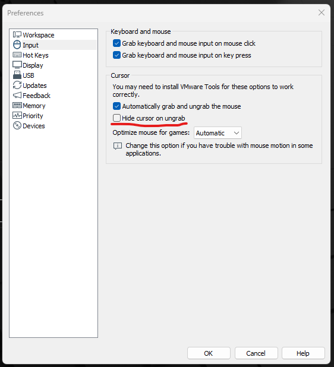

## Instrucciones para ejecutar el módulo de kernel

1. Abre una terminal y navega al directorio del módulo:
    ```bash
    cd ~/SOPES2/Ejemplo_Modulo_Kernel
    ```

2. Compila el módulo usando `make`:
    ```bash
    make
    ```

3. Inserta el módulo en el kernel:
    ```bash
    sudo insmod vmouse.ko
    ```

4. Verifica que el módulo esté cargado:
    ```bash
    lsmod | grep vmouse
    ```

5. Consulta los mensajes del kernel para ver la salida del módulo:
    ```bash
    dmesg | tail
    ```

    Para mover el mouse, escribe en /proc/vmouse_control
    ```bash
    echo "10 10" > /proc/vmouse_control
    ```
    Mueve el mouse 10 pixeles en X y 10 pixeles en Y

6. Para remover el módulo:
    ```bash
    sudo rmmod vmouse
    ```

7. Limpia los archivos generados:
    ```bash
    make clean
    ```

## ¿Qué hace este módulo?

Este módulo de kernel es un ejemplo básico que, al ser cargado, permite controlar el mouse, escribiendo en /proc/vmouse_control el dx y dy en formato dos enteros separados por un espacio, ej: "10 10"

## NOTA
Si el modulo se ejecuta en una maquina virtual es posible que el sistema anfitrion tome el control del mouse por motivos de usabilidad.
Para VMware es posible deshabilitar este comportamiento cambiendo los siguientes ajustes:


En el archivo .vmx de la maquina virtual agrega esta linea al final:
```vmmouse.present = "FALSE"```

En la configuracion de Vmware asegurate que desmarcar la opcion "hide cursor on ungrab" o será dificil ver los movimientos del mouse

